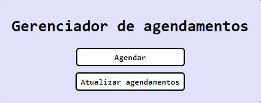
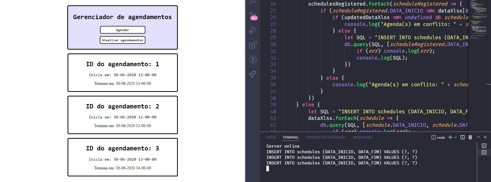
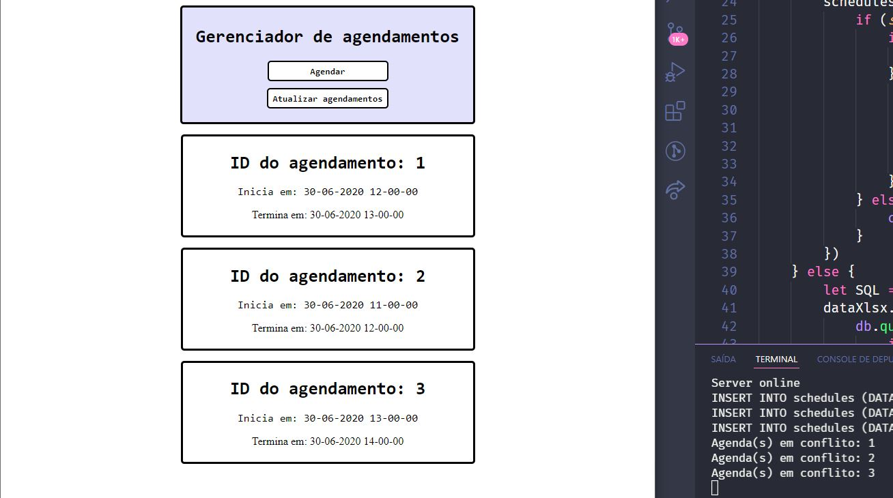
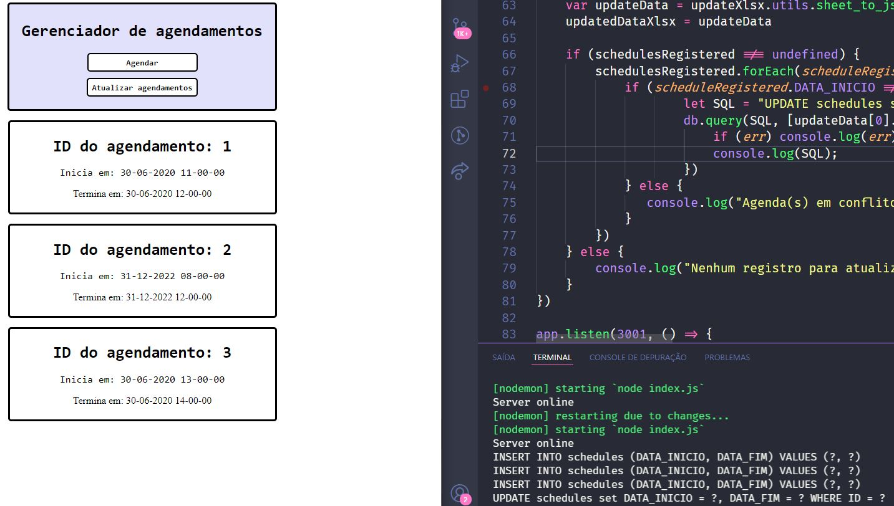
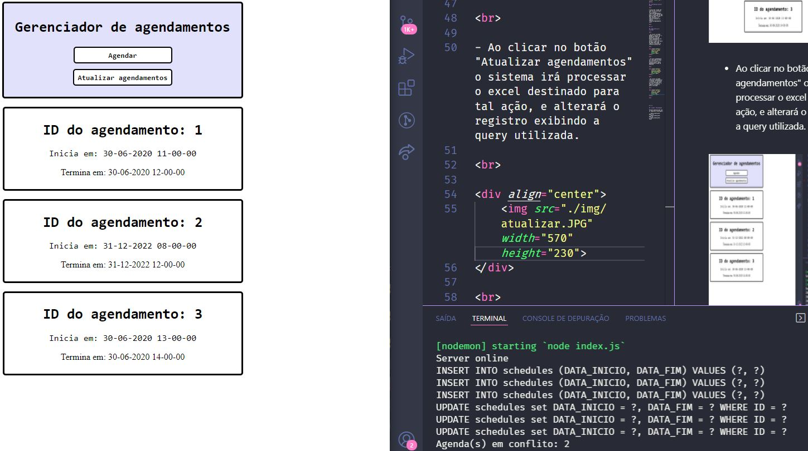
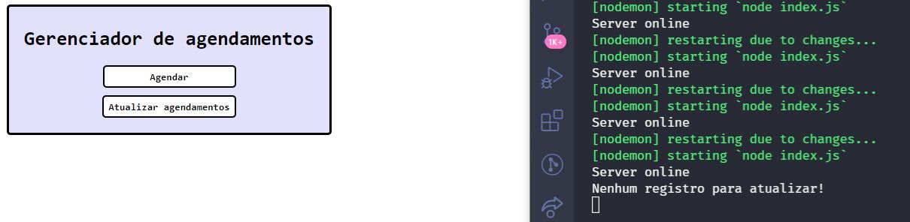

<h1 align="center"> 
 
    
 
 
Teste técnico Triple Tech
</h1>

## :information_source: Sobre

 

A aplicação criada tem como função principal, ler o arquivo "AdicionarAgendamento.xlsx" e fazer upload dos dados encontrados em uma base de dados, assim como atualizar um registro presente no arquivo "AtualizarAgendamento.xlsx".

 

## :page_with_curl: Tutorial

 

- Ao clicar no botão agendar o portal fará o upload dos dados da planilha, e se não houver agendamentos em co,flito de horário, exibirá a query do banco de dados para cada registro realizado no console da aplicação.

 

    

 

- Se outro agendamento for realizado no mesmo horário de inicio, o console exibirá quais agendamentos estão em conflito.

 

    

 

- Ao clicar no botão "Atualizar agendamentos" o sistema irá processar o excel destinado para tal ação, e alterará o registro exibindo a query utilizada.

 

    

 

- Ao tentar atualizar novamente, o sistema reconhecerá que há uma agenda em conflito e exibirá novamente a mensagem notificando o usuário sobre isso.

 

    

 

- Por fim, se o usuário tentar atualizar algum registro, com o banco de dados vazio, ele será notificado que não há nenhum agendamento para ser atualizado.

 

    

 

## :rocket: Tecnologias 

Projeto desenvolvido com as seguintes tecnologias:

- :heavy_check_mark: React JS
- :heavy_check_mark: Node JS
- :heavy_check_mark: MySql